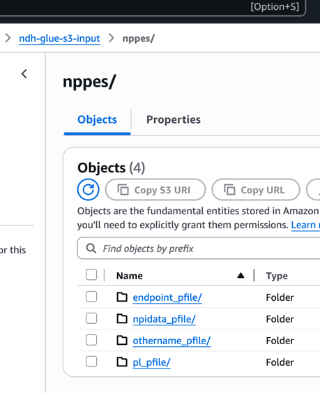
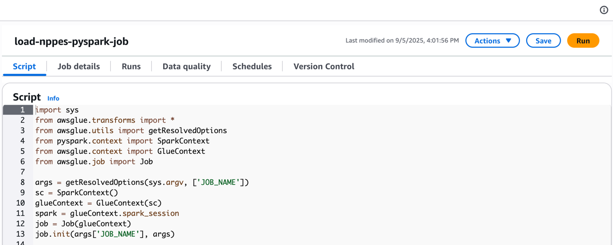
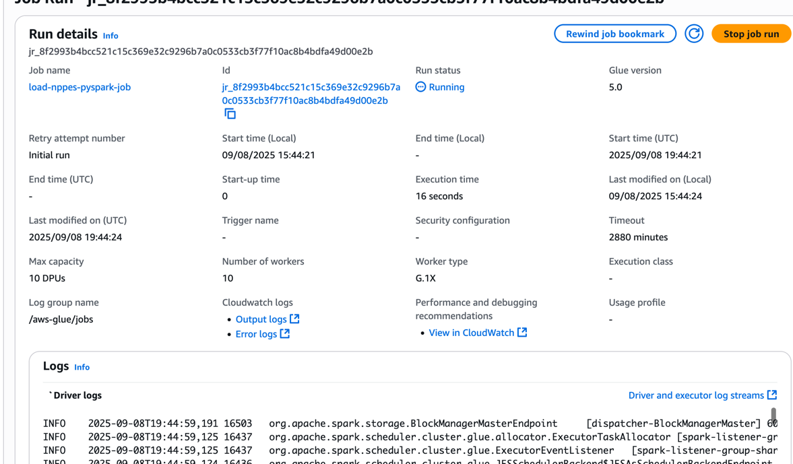
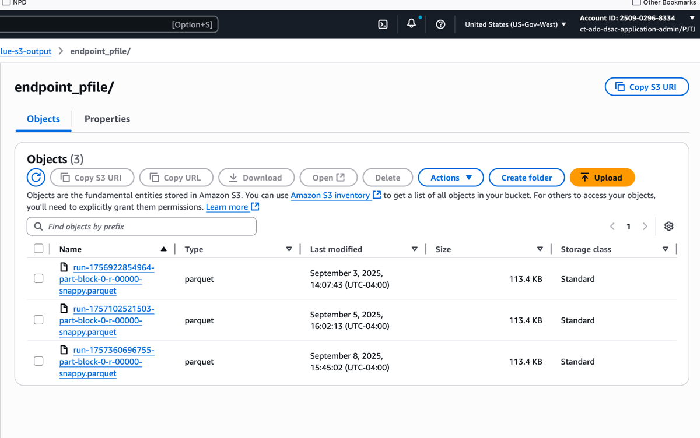

# NPPES To S3

This is a proof-of-concept to illustrate a minimal AWS Glue job running on Spark.
It reads a single CSV table from one location in S3 and writes it to another as parquet.

## Usage

Add the following files from a weekly update archive from NPPES to their corresponding directories:

| Filename                                     | Directory        |
|----------------------------------------------|------------------|
| endpoint_pfile_<start_date>-<end_date>.csv   | endpoint_pfile   |
| npidata_pfile_<start_date>-<end_date>.csv    | npidata_pfile    | 
| othername_pfile_<start_date>-<end_date>.csv  | othername_plfile |
| pl_pfile_<start_date>-<end_date>.csv         | pl_pfile         | 

Next, in AWS Glue, click the run button for the job:

After starting the job, open the "Runs" tab, then "View Details" for the running job.

Note that Spark logs are being listed under "Driver logs". After the job has completed, view the output
in the output s3 bucket.

