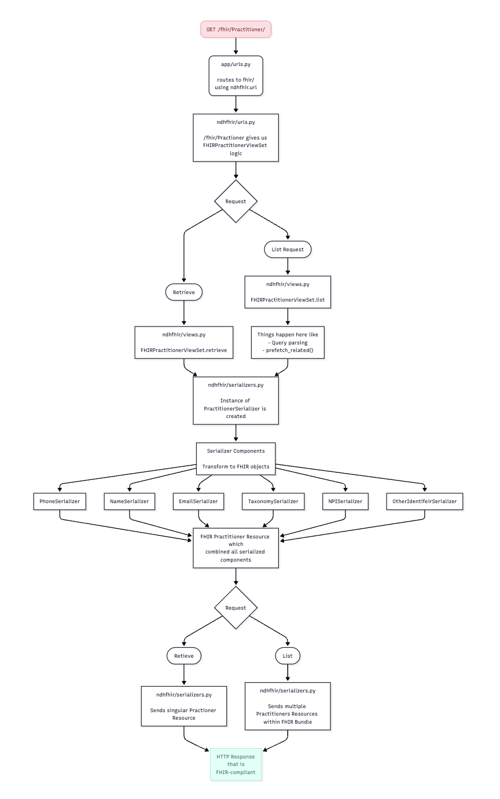

# ndhfhir
Django backend that provides a FHIR API for accessing data from the NDH database.

## Project structure
* The ndhfhir directory contains code that drives the api
* The app directory contains code that controls the overall application
* The root directory contains code for deploying the application within a docker container

## Contributing to ndh-api
### Prerequesites
- [docker](https://www.docker.com/)
- [colima](https://github.com/abiosoft/colima) (if using macOS)
- a postgres database with the ndh schema

### Local dev
1. Ensure that either colima (if using macOS) or the docker service is running
2. Create a `.env` file in this directory, following the template of the `.env_template` file
3. Run `docker-compose up --build` initially and following any changes
4. Happy coding!

## Understanding the Flow of Data through the FHIR API
